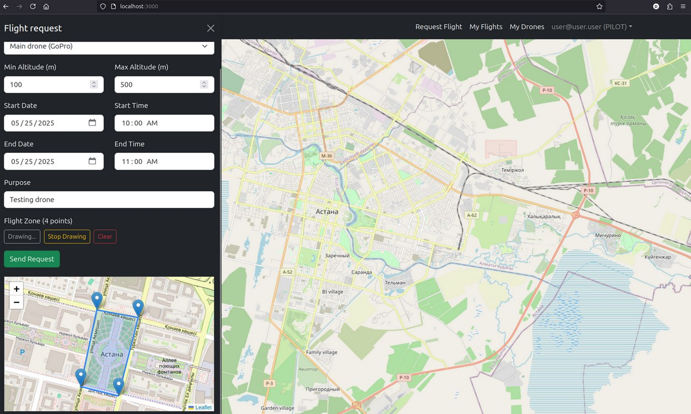
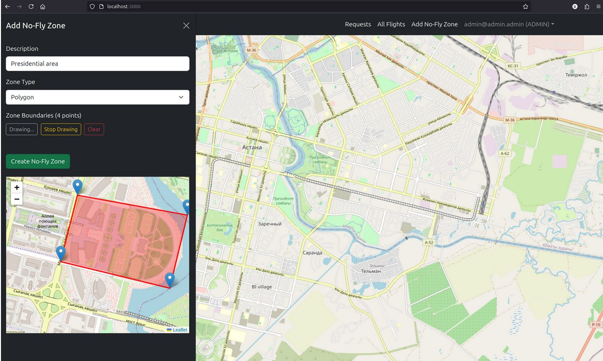

# UTM Drone Management Platform

A web-based **UAS Traffic Management (UTM)** system for managing drone flights, no-fly zones, and real-time drone tracking, with RTMP-to-RTSP video stream support.  
Built with **React.js**, **Node.js/Express**, **PostgreSQL**, **Bootstrap**, and **Podman** (Docker compatible).

---

## Features

- **User Roles:**  
  - **Pilot:** Register, add drones, request flights, view own flights.
  - **Admin:** Approve/reject flight requests, manage no-fly zones, view all flights.

- **Flight Requests:**  
  Pilots submit flight plans (route, altitude, time, purpose). Admins review and approve/reject.

- **No-Fly Zones:**  
  Admins define polygonal restricted areas on the map.

- **Real-Time Drone Tracking:**  
  Approved flights activate live drone tracking on the map via WebSockets.

- **Video Streaming:**  
  RTMP streams from drones are converted to RTSP using [MediaMTX](https://github.com/bluenviron/mediamtx).

- **Notifications:**  
  System notifies pilots if their drone leaves the allowed flight zone.

---

## Screenshots
Flight request example:  
  

Add No-Fly Zone example:  


---

## Architecture

- **Frontend:** React.js, Bootstrap, Leaflet.js (maps)
- **Backend:** Node.js, Express.js, Sequelize ORM
- **Database:** PostgreSQL
- **Streaming:** MediaMTX (RTMP/RTSP)
- **WebSockets:** Real-time telemetry and tracking
- **Containerization:** Podman (Docker compatible)

---

## Getting Started

### Prerequisites

- [Podman](https://podman.io/) or [Docker](https://www.docker.com/)
- [Node.js](https://nodejs.org/) (for local dev)
- [npm](https://www.npmjs.com/)

### Clone the Repository

```bash
git clone https://github.com/yourusername/utm-drone-platform.git
cd utm-drone-platform
```

---

## Installation & Setup

### 1. Environment Variables

Create a `.env` file in the root directory (or set variables in your shell):

```env
POSTGRES_PASSWORD=your_postgres_password
DB_PASSWORD=your_postgres_password
SECRET_KEY=your_secret_key
```

### 2. Start with Podman (or Docker Compose)

```bash
podman-compose up --build
# or
docker-compose up --build
```

This will start:
- PostgreSQL database
- MediaMTX streaming server
- Backend API server (Node.js/Express)
- (Frontend runs separately, see below)

### 3. Frontend Setup

```bash
cd client
npm install
npm start
```

The frontend will be available at [http://localhost:3000](http://localhost:3000).

---

## Usage

### User Flows

#### Pilot
1. Register as a pilot.
2. Add your drones.
3. Request a flight by drawing a route on the map and filling in details.
4. View your flight requests and their statuses.

#### Admin
1. Log in as admin (set user role to `ADMIN` in the database if needed).
2. Review and approve/reject flight requests.
3. Add/manage no-fly zones.
4. View all active and past flights.

#### Real-Time Tracking
- Once a flight is approved, the drone appears on the map with live position updates.
- Clicking a drone marker shows detailed flight info (see screenshot above).

#### Video Streaming
- Drones can stream video via RTMP to the MediaMTX server.
- The system provides an RTSP URL for playback.

---

## Development

- **Backend:**  
  ```bash
  cd server
  npm install
  npm run dev
  ```

- **Frontend:**  
  ```bash
  cd client
  npm install
  npm start
  ```

- **Database:**  
  Uses PostgreSQL, auto-migrated by Sequelize.

- **Streaming:**  
  MediaMTX is configured via `mediamtx.yml`.

---

## API Endpoints

- `/api/user/registration` – Register user
- `/api/user/login` – Login
- `/api/drone` – CRUD for drones
- `/api/flight` – CRUD for flights, approval/rejection
- `/api/noflyzone` – CRUD for no-fly zones

---

## Notes

- **Admin User:**  
  To create an admin, register normally and update the user’s role to `ADMIN` in the database.

- **Simulated Drones:**  
  The backend includes a drone simulator for demo/testing. Real drones can connect via WebSocket and send telemetry.

- **RTMP/RTSP:**  
  Drones stream to `rtmp://<server>:1935/live/<flightId>`.  
  RTSP playback is available at `rtsp://<server>:8554/live/<flightId>`.

---

## Troubleshooting

- **Ports:**  
  - Backend: `5000`
  - Frontend: `3000`
  - PostgreSQL: `5432`
  - MediaMTX: `1935` (RTMP), `8554` (RTSP), `9997` (API)

- **Database Issues:**  
  If schema changes, remove the `postgres_data` volume and restart.

- **WebSocket Issues:**  
  Ensure backend is running and accessible on the correct port.
